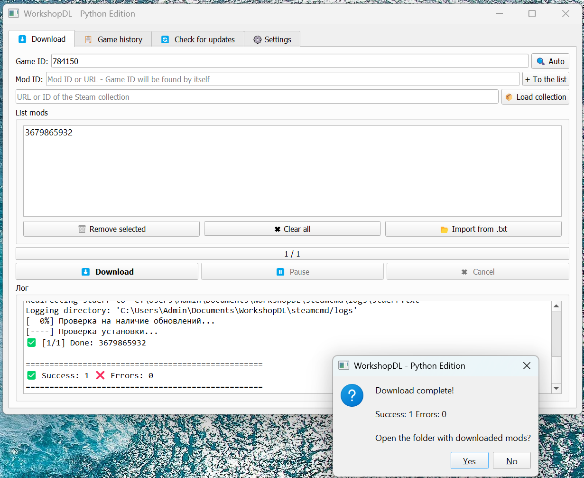

# WorkshopDL — Python Edition

<div align="center">


**A cross-platform Steam Workshop mod downloader with a clean GUI.**  
Inspired by the original [WorkshopDL](https://github.com/imwaitingnow/WorkshopDL) by imwaitingnow.

</div>

---

---

## 🌐 README translations

| Language | File |
|---|---|
| 🇬🇧 English | [README.md](README.md) ← you are here |
| 🇷🇺 Русский | [README_RU.md](README/RU.md) |
| 🇩🇪 Deutsch | [README_DE.md](README/DE.md) |
| 🇨🇳 中文 | [README_ZH.md](README/ZH.md) |

> Want to add your language? See the [Translations](#-translations) section below.

---

## ✨ Features

- **⬇ Download mods** via SteamCMD — single mod or entire lists
- **📦 Import Steam collections** — paste a collection URL and get all mods at once
- **🔍 Auto Game ID detection** — just paste a Mod ID, the Game ID fills itself
- **🔄 Update checker** — scan a local mods folder, see which are outdated vs up-to-date
- **⏸ Pause & resume** — stop mid-queue and continue on next launch
- **🔘 Enable / Disable mods** — toggle mods on/off without deleting (renames folder to `.disabled`)
- **📋 Game history** — remembers every game you've downloaded mods for
- **📁 One-click folder open** — open mod or game folder straight from the UI
- **💾 Size column** — see how much disk space each mod uses
- **🌐 Localization** — full UI translation via simple JSON files
- **🖥 Cross-platform** — Windows, Linux, macOS

---

## 📦 Requirements

```
Python 3.8+
PyQt5
requests
```

Install dependencies:
```bash
pip install PyQt5 requests
```

---

## 🚀 Quick Start

1. Clone or download this repository
2. Install dependencies (see above)
3. Run:
   ```bash
   python workshopdl.py
   ```
4. Go to **Settings** → click **⬇ Download SteamCMD Automatically**
5. Enter a Mod ID on the **Download** tab — Game ID will be detected automatically
6. Click **⬇ Download**

---

## 🗂 Project Structure

```
WorkshopDL/
├── workshopdl.py        # Main application
├── lang/                # Lang (опционально)
│   ├── de.json
│   ├── en.json         # Английская локализация (по умолчанию
│   ├── ru.json         # Русская локализация
│   └── zh.json
├── Modules/             # Runtime data (auto-created)
│   ├── queue.json       # Pause/resume queue
│   ├── history.json     # Game history
│   └── mod_paths.json   # Saved mod folder paths
├── steamcmd/            # SteamCMD installation (auto-created)
└── WorkshopDL.ini       # User settings
```

---

## 🔄 Update Checker

The **🔄 Check Updates** tab lets you scan any local folder containing mods
(e.g. `C:\games\SovietRepublic\media_soviet\workshop_wip`).

The folder must contain numeric subfolders — one per mod:
```
workshop_wip/
├── 1797996358/
├── 1807300910/
└── 2031421793.disabled   ← disabled mod (excluded from game)
```

WorkshopDL compares the local folder modification date against the
`time_updated` field from the Steam API and marks each mod as:

| Icon | Meaning |
|---|---|
| 🔴 | Outdated — server has a newer version |
| 🟢 | Up to date |
| 🔘 | Disabled (folder has `.disabled` suffix) |
| ⚪ | Unknown — Steam API returned no data |

---

## 🔘 Enabling / Disabling Mods

Click the **⏸ / ▶** button in the table to toggle a mod.  
This simply renames the folder:

```
1797996358          →   1797996358.disabled    (disabled)
1797996358.disabled →   1797996358             (enabled)
```

No files are deleted. Your game will ignore `.disabled` folders
(depending on the game's mod loader).

---

## 🌐 Translations

All UI strings live in a single JSON file. To create a new translation:

1. Copy `lang_en.json` and rename it, e.g. `lang_fr.json`
2. Translate the **values** (right side of each line) — do not change the keys
3. In **Settings → Language**, browse to your file and click **✅ Apply**

### Contributing a translation

To share your translation with everyone:
- Add your `lang_XX.json` file to the `lang/` folder in this repository
- Open a Pull Request — we'll add it to the download list in the app

---

## ⚙ Settings

| Setting | Description |
|---|---|
| Anonymous mode | Download without a Steam account (most mods support this) |
| Steam login / password | Required only if anonymous mode is off |
| SteamCMD path | Path to `steamcmd` binary — or download automatically |
| Language | Path to a localization `.json` file |
| Mods update path | Default folder for the Update Checker |

---

## 🛠 SteamCMD

WorkshopDL uses [SteamCMD](https://developer.valvesoftware.com/wiki/SteamCMD)
to download mods. You don't need to install it manually —
go to **Settings** and click **⬇ Download SteamCMD Automatically**.

On first run SteamCMD downloads its own engine files (~40 MB). This happens
once and is shown in the Settings log.

| Platform | Binary | Download |
|---|---|---|
| Windows | `steamcmd.exe` | `.zip` |
| Linux | `steamcmd.sh` | `.tar.gz` |
| macOS | `steamcmd` | `.tar.gz` |

---

## 📄 License

MIT — do whatever you want, attribution appreciated.

---

<div align="center">
Made with ☕ and PyQt5
</div>
